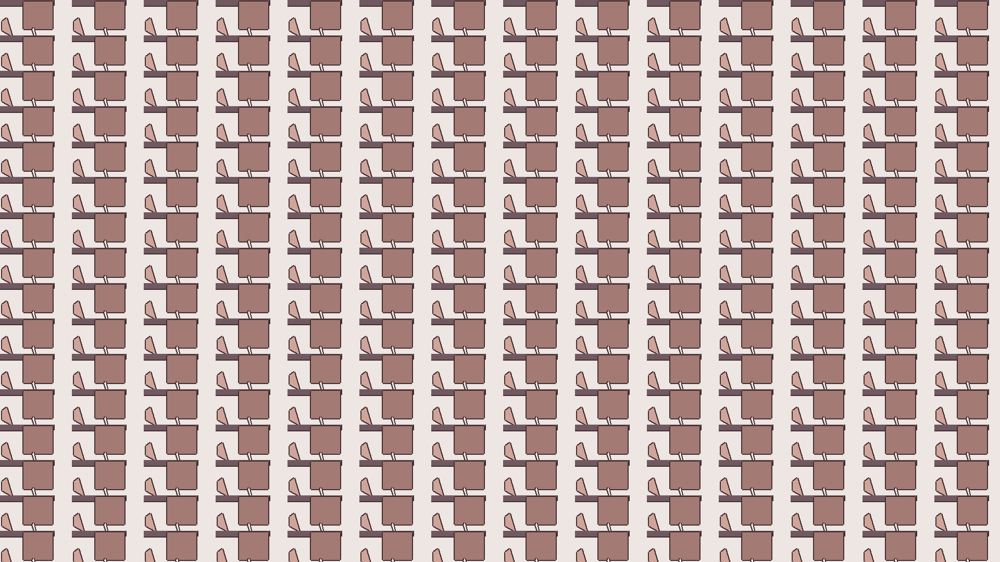

# imgen

> image generator

[](https://opensource.org/licenses/MIT)

A simple Python program that generates random images with repeating patterns



## Installation

pip install this repo.
(Note: Incompatible with Python 2.x)

```sh
pip3 install git+https://github.com/zahash/imgen.git

(or)

pip install git+https://github.com/zahash/imgen.git
```

## Usage example

To get help with commandline arguments

```sh
python3 -m imgen --help
```

Using Command-line Arguments

```sh
python3 -m imgen -f "some/folder/asdf.png" -rh 1920 -rv 1080 -d
```

## Development setup

Clone this repo and install packages listed in requirements.txt

```sh
pip3 install -r requirements.txt
```

## Meta

M. Zahash – zahash.z@gmail.com

Distributed under the MIT license. See `LICENSE` for more information.

[https://github.com/zahash/](https://github.com/zahash/)

## Contributing

1. Fork it (<https://github.com/zahash/imgen/fork>)
2. Create your feature branch (`git checkout -b feature/fooBar`)
3. Commit your changes (`git commit -am 'Add some fooBar'`)
4. Push to the branch (`git push origin feature/fooBar`)
5. Create a new Pull Request
